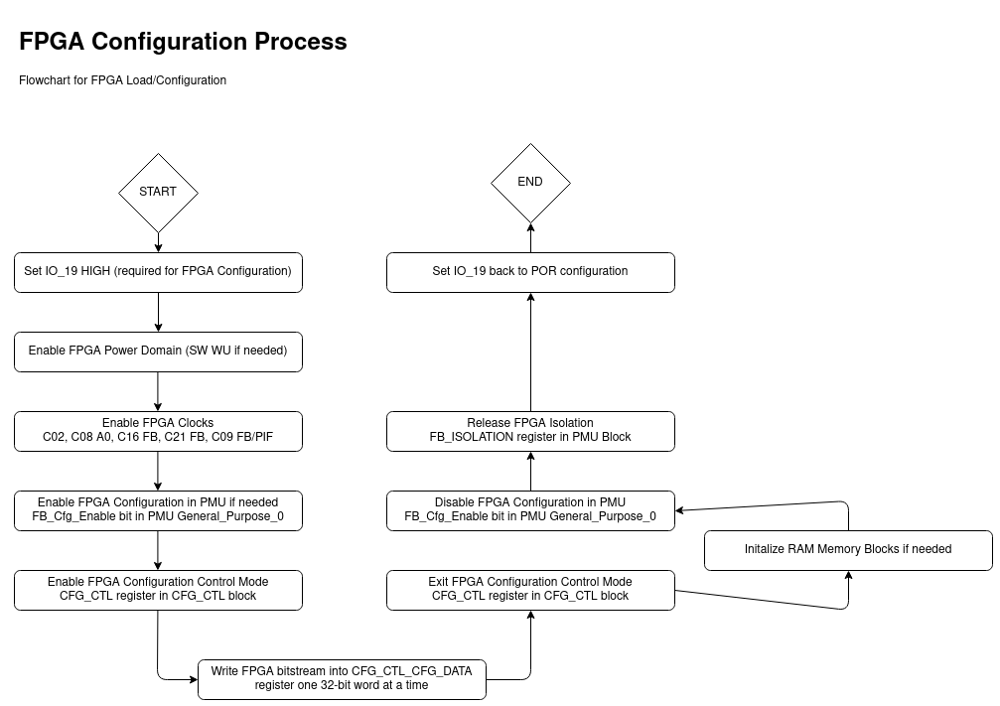

FPGA Loader
===========

This is a Library component, which executes loading a FPGA bitstream into the EOS S3 FPGA and configuring the FPGA domain.

There are 2 APIs currently supported, which can be called from any M4 Application:

1. :code:`int load_fpga(uint32_t img_size,uint32_t* image_ptr)`

   This API takes in a bitstream array of 32-bit values which is generated by the FPGA tooling in the right format.

2. :code:`int load_fpga_with_mem_init(uint32_t image_size, uint32_t* image_ptr, uint32_t mem_content_size, uint32_t* mem_content_ptr)`

   This API takes in a bitstream array of 32-bit values, as well as a meminit array of 32-bit values, both of which are generated by the FPGA tooling in the right format.

   If the FPGA design uses RAM blocks, and has the initialization values defined in hex files, then the FPGA tooling generates the meminit array, which can be passed here to initialize the RAM blocks.

The FPGA Load process flowchart is described in the diagram below:

::

    TODO: Add more detailed FPGA Load process, adding in the necessary steps, when EOS S3 is not starting at RESET.
    For example, when we have to load a different FPGA bitstream, without resetting the EOS S3.