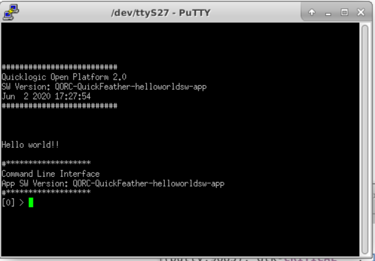
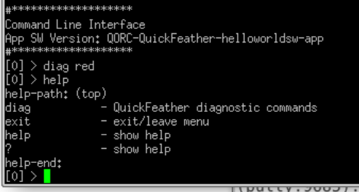
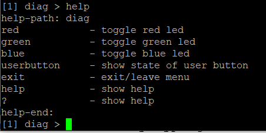

QORC SDK
========

QuickLogic Open Reconfigurable Computing (QORC) SDK provides components
needed to get started on the QuickLogic's EOSS3 device and open source
development boards such as Quickfeather.

|travis-ci|   |rtd-docs|

Currently, the following boards are supported:

-  `Quickfeather Development
   Kit <https://www.quicklogic.com/products/eos-s3/quickfeather-development-kit/>`__

Getting started on Quickfeather board
-------------------------------------

Easiest way to get started on quickfeather development kit is to build
and run example application projects included in this SDK on a
quickfeather development kit.

| Clone this QORC SDK repository using
| ``git clone --recursive https://github.com/QuickLogic-Corp/qorc-sdk``

Install the items listed in Pre-requisites section below.

Pre-requisites
--------------

Toolchain
~~~~~~~~~

-  Firmware

   1. Download tarball according to the system configuration from:
      https://developer.arm.com/tools-and-software/open-source-software/developer-tools/gnu-toolchain/gnu-rm/downloads

      Current stable version tested with is ``9-2020-q2-update``

   2. Extract the tarball to a preferred path(/BASEPATH/TO/TOOCHAIN/)

      ``sudo tar xvjf gcc-arm-none-eabi-your-version.tar.bz2 -C /BASEPATH/TO/TOOCHAIN/``

      The usual preferred path is for example ``/usr/share``

      ``sudo tar xvjf gcc-arm-none-eabi-9-2020-q2-update-x86_64-linux.tar.bz2 -C /usr/share/``

   3. Add the /BASEPATH/TO/TOOCHAIN/gcc-arm-none-eabi-your-version/bin/
      to PATH (only for current terminal session)

      ``export PATH=/BASEPATH/TO/TOOCHAIN/gcc-arm-none-eabi-your-version/bin/:$PATH``

      For the preferred path of ``/usr/share`` and current tested stable
      version ``9-2020-q2-update`` for example:

      ``export PATH=/usr/share/gcc-arm-none-eabi-9-2020-q2-update/bin/:$PATH``

   4. If the path settings need to be permanent, it can be added to the
      ``~/.bashrc`` or ``~/.bash_profile.``

      Examples and illustrations are for example here:
      https://stackabuse.com/how-to-permanently-set-path-in-linux/

-  Gateware

   -  QuickLogic Symbiflow: Refer `QuickLogic
      Symbiflow <https://github.com/QuickLogic-Corp/quicklogic-fpga-toolchain>`__
      to install the QuickLogic Symbiflow toolchain

Utilities
~~~~~~~~~

-  Flash programmer: TinyFPGA programmer

   Refer to `TinyFPGA
   programmer <https://github.com/QuickLogic-Corp/TinyFPGA-Programmer-Application>`__
   for installation instructions.

-  Terminal application program such as: `putty <https://putty.org/>`__

   ::

      sudo apt-get install putty -y

-  Miscellaneous: `GNU make
   3.8.1 <https://sourceforge.net/projects/gnuwin32/files/make/3.81/>`__
   or equivalent

Hardware
~~~~~~~~

-  Quickfeather development kit
-  A micro USB cable
-  [Optional] A serial-to-USB cable
-  [Optional] `J-Link Debug
   probe <https://www.segger.com/products/debug-probes/j-link/>`__

Baremetal Example
-----------------

The qf_baremetal app tests qf_baremetalsetup which sets up the power
domains and clocks without using the S3X_CLK_XXX management, or the
power management schemes. As a result the code is smaller and simpler,
however all of the responsibility is on the user to get the right power
domains enabled, and the clocks set correctly.

.. _lesson-1a-m4-only--qf_helloworldsw:

Lesson #1a: M4 only – qf_helloworldsw
-------------------------------------

This section describes how to build and run the qf_helloworldsw project.

1.  Navigate to qf_helloworldsw build folder and run make

    ::

       cd qorc-sdk/qf_apps/qf_helloworldsw/GCC_Project
       make 

2.  | Reset QuickFeather board and press ‘user button’ while blue LED is
      flashing.
    | Should switch to mode where green LED is breathing.
    | If green LED not breathing, press reset again and ‘user button’
      within 5 seconds of releasing reset (while blue LED is still
      flashing)

3.  With green LED breathing, program qf_helloworldsw app into
    QuickFeather:

    ::

       qfprog --port /dev/ttyXX --m4app output/bin/qf_helloworldsw.bin

    replace /dev/ttyXX with the actual device path.

4.  | After programming has completed, reset the QuickFeather board and
      do not press the user button.
    | Blue LED should flash for 5 sec and then load the m4app and run
      it.

5.  Run PuTTY or some other terminal emulator and attach to the
    QuickFeather (NOTE: the port name will most probably be different
    than the port name used for programming).

6.  | You should see a banner that says:
    | |qf_helloworldsw banner|

7.  The prompt ‘[0]’ indicates that you are level 0 in the CLI menus
    system. Type ``diag red`` and you should see the red LED on
    QuickFeather light up

8.  | Type ``help`` and you should see:
    | |qf_helloworld CLI Help|

    Which lists what is in the top-level CLI menu:

    1. diag is a user defined sub-menu
    2. the others are there by default

9.  | Type ``diag`` to enter the diag sub-menu:
    | You should see
    | |qf_helloworld CLI diag|

    Where the [1] diag indicates that you are in a 1st level submenu
    called diag

10. | Type ``help`` to get help for this menu and you should see:
    | |qf_helloworld CLI diag sub-menu|

11. You can try these by typing red (should turn the red led off), green
    and so forth. Note that if you are level 0, you can access submenu
    elements by typing ``submenuname submenu action``, which is what we
    did earlier when we typed ``diag red``

.. _lesson-1b-m4-only--modify-qf_helloworldsw:

Lesson #1b: M4 only – modify qf_helloworldsw
--------------------------------------------

1. | Using the editor of your choice, edit
     ``qorc-sdk/qf_apps/qf_helloworldsw/src/main.c``. Change the line
   | ``dbg_str(“\n\nHello world !!\n\n”)``
   | to say something else. Save the changes

2. Now naviagte to qf_helloworldsw build folder and run make.

   ::

      cd qorc-sdk/qf_apps/qf_helloworldsw/GCC_Project  
      make

3. Reset QuickFeather board and press ‘user button’ while blue LED is
   flashing.

   1. Should switch to mode where green LED is breathing
   2. If green LED not breathing, press reset again and ‘user button’
      within 5 seconds of releasing reset

4. With green LED breathing, program the updated qf_helloworldsw app
   into QuickFeather:
   ``qfprog --port /dev/ttyXX --m4app output/bin/qf_helloworldsw.bin``

5. After programming has completed, reset the QuickFeather board and do
   not press the user button.

   1. Blue LED should flash for 5 sec and then load the m4app and run it

6. Run PuTTY or some other terminal emulator and attach to the
   QuickFeather (NOTE: the port name will most probably be different
   than the port name used for programming).

7. You should see a banner and then your changed message.

.. _lesson-2a-fpga-only--qf_helloworldhw:

Lesson #2a: FPGA only – qf_helloworldhw
---------------------------------------

1. Navigate to qf_helloworldsw build folder and run make.
   ::

      cd qorc-sdk/qf_apps/qf_helloworldhw/GCC_Project
      make

2. Reset QuickFeather board and press ‘user button’ while blue LED is
   flashing.

   1. Should switch to mode where green LED is breathing
   2. If green LED not breathing, press reset again and ‘user button’
      within 5 seconds of releasing reset

3. With green LED breathing, program qf_helloworldhw app into
   QuickFeather:
   ``qfprog --port /dev/ttyXX --m4app output/bin/qf_helloworldhw.bin``
4. After programming has completed, reset the QuickFeather board and do
   not press the user button.

   1. Blue LED should flash for 5 sec and then load the m4app which will
      load the FPGA and run that

5. You should see the green LED flashing about 3 times/second.
6. You will not see QuickFeather mounted on USB, because now the FPGA is
   used for the custom FPGA code, not the standard USB2SERIAL code. And
   because of this you cannot use PuTTY to monitor the application. (See
   Lesson#3 for how to monitor applications while running custom FPGA
   code).
7. How does this work:

   1. If you look at main.c you will find the following code fragment:

   .. code:: C

      load_fpga(sizeof(axFPGABitStream),axFPGABitStream);     // Load bitstream into FPGA
      S3x_Clk_Enable(S3X_FB_21_CLK);                          // Start FPGA clock
      S3x_Clk_Enable(S3X_FB_16_CLK);

   2. The array, axFPGABitStream, is located in
      fpga/rtl/helloworldfpga_bit.h which is generated from the Verilog
      by ql_symbiflow
   3. What the ``load_fpga()`` does is take the bitstream from array
      axFPGABitSTream and program the FPGA
   4. What the ``S3x_Clk_Enable(S3X_FB_21_CLK)`` does is to enable CLK
      21 which is one of two clocks from the M4 that drive the FPGA
   5. The frequency of the clock is specified in src/s3xd_pwrcfg.c to be
      48MHz
      .. code:: C

         [CLK_C21] = {
         .name = "C21",
         .clkd_id = CLK_C21,
         .type = SRC_CLK,
         .sync_clk = SYNC_CLKD (0, 0, 0),
         .cru_ctrl = CRU_CTRL (0x34, 0x1fe, 9, 0x38, 0x70, 0x1, 8),
         .def_max_rate = (F_48MHZ),
         .init_state = INIT_STATE(F_48MHZ, 1, INIT_GATE_OFF),},

.. _lesson-2b-fpga-only--modify-qf_helloworldhw:

Lesson #2b: FPGA only – modify qf_helloworldhw
----------------------------------------------

1. Using the editor of your choice, edit
   qf_apps/qf_helloworldhw/fpga/rtl/helloworldfpga.v

   1. Change the terminal counter from 4000000 to 2000000
   2. Change the assign greenled = led to assign redled = led
   3. Save the changes

2. Activate the conda script from ``quicklogic-fpga-toolchain`` and add
   it's binaries to PATH. (This step can be skipped if you have
   installed the toolchain in the current terminal window and session).

   ::

      export INSTALL_DIR="specify the installpath of fpga-toolchain"
      export PATH="$INSTALL_DIR/install/bin:$INSTALL_DIR/install/bin/python:$PATH"
      source "$INSTALL_DIR/conda/etc/profile.d/conda.sh"

3. Navigate to qf_helloworldhw build folder and run make (note: for make
   use ql_symbiflow you will have to activate the ql_symbiflow conda)

   ::

      cd qf_apps/qf_helloworldhw/GCC_projects
      conda activate
      make
      conda deactivate

4. Reset QuickFeather board and press ‘user button’ while blue LED is
   flashing

   1. Should switch to mode where green LED is breathing
   2. If green LED not breathing, press reset again and ‘user button’
      within 5 seconds of releasing reset

5. With green LED breathing, program the updated qf_helloworldhw app
   into QuickFeather:
   ``qfprog --port /dev/ttyXX --m4app output/bin/qf_helloworldhw.bin``

6. After programming has completed, reset the QuickFeather board and do
   not press the user button

   1. Blue LED should flash for 5 sec and then load the m4app which
      loads the new FPGA code and runs it

7. You should see the red LED flashing about 6 times/second

8. You will not see QuickFeather mounted on USB, because now the FPGA is
   used for the custom FPGA code, not the standard USB2SERIAL code. And
   because of this you cannot use PuTTY to monitor the application. (See
   Lesson#3 for how to monitor applications while running custom FPGA
   code

.. _lesson-3-advanced-fpga-m4--fpga-qf_advancedfpga:

Lesson #3: Advanced fpga M4 + FPGA– qf_advancedfpga
---------------------------------------------------

1.  Go to directory qf_apps/qf_advancedfpga/GCC_projects
2.  Activate conda, run make and deactivate conda
3.  Connect to the QuickFeather UART

    1. Connect a serial-to-USB cable to the QuickFeather board
    2. Connect PuTTY to the serial port associated with the
       serial-to-USB cable
    3. Set baud rate to 115200

4.  Reset QuickFeather board and press ‘user button’ while blue LED is
    flashing

    1. Should switch to mode where green LED is breathing
    2. If green LED not breathing, press reset again and ‘user button’
       within 5 seconds of releasing reset

5.  With green LED breathing, program m4 app into QuickFeather

    1. python tinyfpgaprogrammer - -port /dev/ttyXX - -m4app
       output/bin/qf_advancedfpga.bin

6.  After programming has completed, reset the QuickFeather board and do
    not press the user button

    1. Blue LED should flash for 5 sec and then load the m4app and run
       it

7.  The banner should be printed on PuTTY and then the CLI prompt

    1. Switch to the ledctlr sub-menu by entering ‘ledctlr’
    2. Set the color for timeslot 0 to blue by ‘color0 1’ – led should
       go blue
    3. Set the color for timeslot 1 to green by ‘color1 2’ – no visible
       change
    4. Set the color for timeslot 2 to red by ‘color2 4’ – no visible
       change
    5. Set the duration of timeslot 0 to 500ms by ‘duration0 500’
    6. Set the duration of timeslot 1 to 500ms by ‘duration1 500’

8.  Now the LED should display green for 500ms, then blue for 500ms and
    repeat
9.  Set the duration of timeslot 2 to 1000ms by ‘duration2 1000’
10. Now LED should be blue for 500ms, green for 500ms and red for 1000ms
    and repeat

Creating an application
-----------------------

To create an application start by choosing an existing application that
is a close match to your end goal and simply copy the entire application
directory giving the name you want. The make files assume that the
application directory is two levels from the top-level directory. For
example qorc-sdk/qf_apps/ so you can either create your own project
directory and copy the app there, for example
qorc-sdk/qf_myprojects/qf_myapp, or put it in one of the existing
project directories, for example qorc-sdk/qf_apps/qf_myapp

.. |rtd-docs| image:: https://img.shields.io/readthedocs/qorc-sdk?label=READTHEDOCS&logo=read-the-docs&style=for-the-badge
    :alt: Read the Docs
    :target: https://qorc-sdk.readthedocs.io/en/latest
    
.. |travis-ci| image:: https://img.shields.io/travis/com/QuickLogic-Corp/qorc-sdk/master?label=TRAVIS-CI&logo=travis&style=for-the-badge   
    :alt: Travis (.com) branch
    :target: https://travis-ci.com/QuickLogic-Corp/qorc-sdk

Using Eclipse to Build/Debug applications
-----------------------------------------

Please refer to `Using Eclipse <https://github.com/QuickLogic-Corp/qorc-sdk/blob/master/using_eclipse.rst>`__ .