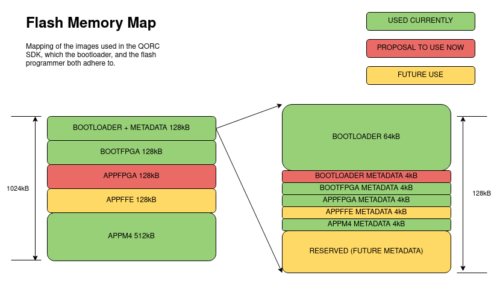
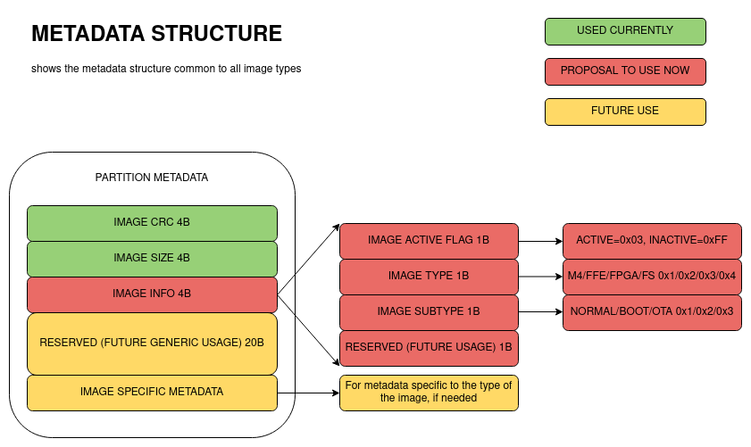
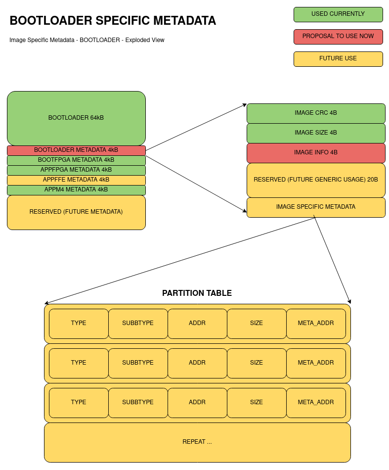

QORC Bootloader
===============

The bootloader supports a flash memory map to store the various images needed by the QORC SDK system.

Flash Memory Map
----------------

The Flash Memory Map is as in the below diagram, with proposed and future changes color coded:

Proposed changes include:

1. add metadata section for the bootloader itself.
2. use the appfpga partition to check and load the fpga image, if programmed.
3. appffe is already present, leave unchanged for now.

Metadata Section changes
------------------------

The metadata section is described the below diagram:

The changes proposed include:

1. Add IMAGE INFO section in the metadata.
   
   IMAGE INFO is divided into:

   a. IMAGE ACTIVE FLAG 1B:

      Have a 1B sentinel value to indicate whether this image should be used or not.
      
      For example, when we move from M4 only use-case to FPGA only use-case, then the M4 image can be marked as inactive.

   b. IMAGE TYPE 1B:

      Have a 1B value indicating the type of image in the partition.

      This would be M4, FFE, FPGA or FileSystem (can be extended to other types later).

   c. IMAGE SUBTYPE 1B:

      Have a 1B value indicating sub-type of image.

      This would be BOOT, NORMAL, OTA (can be extended to others later)

   d. RESERVED 1B: 

      For future use.

2. Add RESERVED bytes for further metadata till the 8 word boundary

   For future use, keep a total of 8 words for use as generic metadata.

   Of these, we use 3 words (CRC, SIZE, INFO) in current proposal.

3. Add Image Specific Metadata

   Each of the image types (M4, FFE, FPGA, FS etc.) can define their own metadata which might be useful.

   For example, the bootloader can have a "partition table" as its internal metadata.

   This can be used to remove a hardcoded flash memory map in the future.

   Mostly, this is a future expansion proposal at this point.

Image Specific Metadata - Bootloader example
--------------------------------------------

The diagram below shows a proposal of using the image specific metadata, for the bootloader.

The partition table can be kept in the bootloader image-specific-metadata, and hence the flash memory map can be changed dynamically.

In this usage example, the bootloader, and the bootloader metadata are the only fixed entities in the flash memory map.

This is mostly a future expansion proposal at this point.
