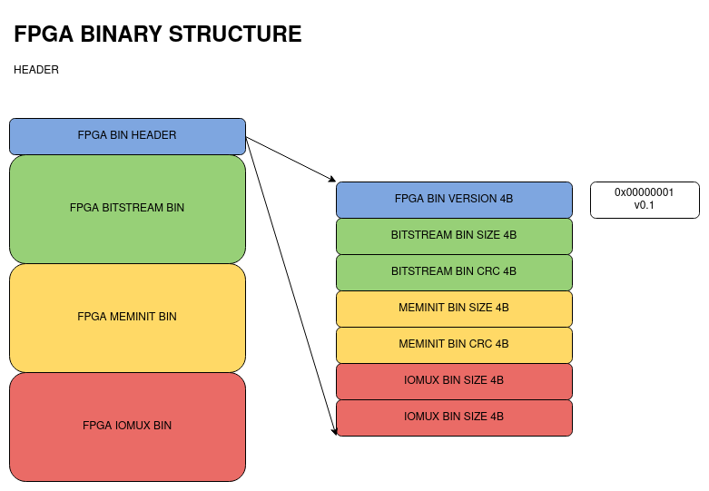
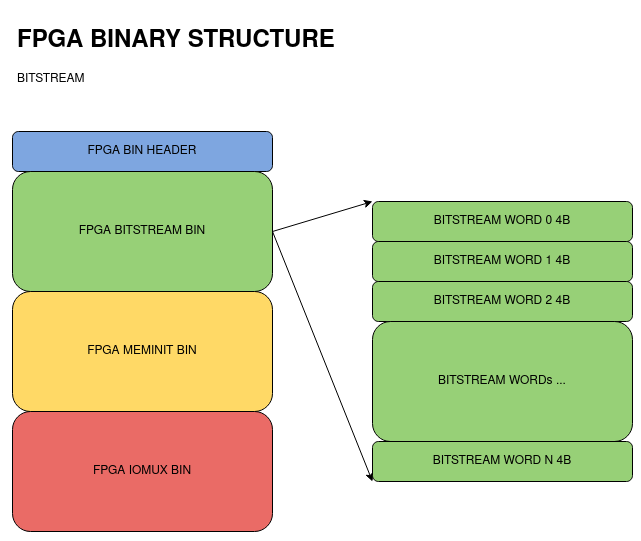
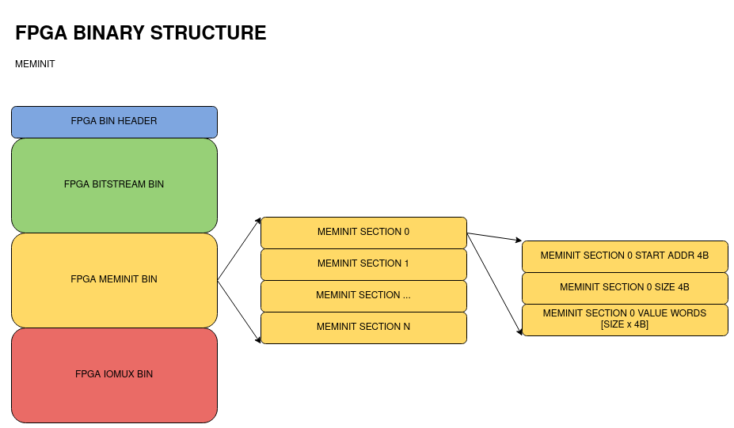
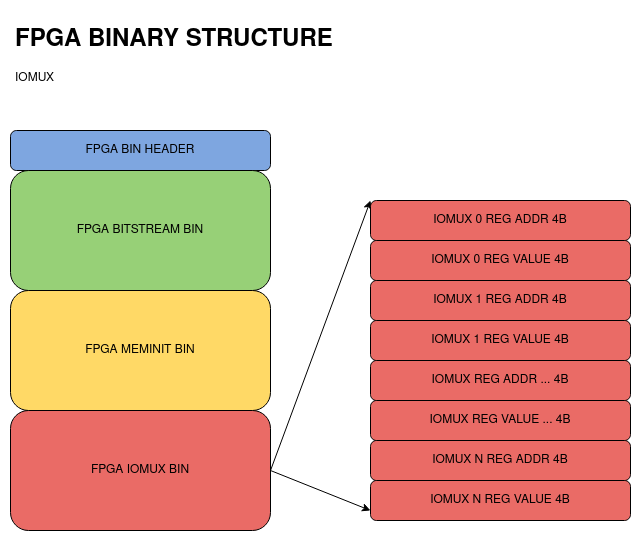

Flashing-Loading Changes For Multi Image Usage
==============================================

Problem
-------

We need a way to support usage scenarios as below:

1. M4 only

   This is currently supported.
   This covers both M4 only usage as well as M4 + FPGA usage where the FPGA code is included inside the M4 binary itself via the header inclusion method.

2. FPGA only

   A way for the users to flash FPGA image, and which the Bootloader can load without need for a M4 image.

3. M4 + (independent)FPGA

   A way to flash the M4 image and FPGA image separately, and ability to load the FPGA image (by Bootloader) followed by loading the M4 image.

4. [FUTURE] FFE combinations

   A way to flash/load independent combinations of M4+FFE, M4+FFE+FPGA in the future.

Current plan is to add support for use cases 2 and 3, 4 being on the future roadmap.

Solution Design P1 - FPGA bin
-----------------------------

We need to generate a binary file for the FPGA, which includes the below components:

1. FPGA bitstream (already being generated as ${TOP}.bit)
2. FPGA meminit (as a separate bin) for FPGA RAM initialization
3. FPGA iomux info (as a separate bin) for proper pad configuration of pads used by the FPGA

Then, FPGA bin [${TOP}.bin] == bitstream bin + meminit bin + iomux bin

We will need a header in the FPGA bin which indicates the component info, for which we will adapt the FFE style of binary structure.

The diagrams below show a complete picture of the FPGA bin structure proposed.

FPGA bin header
~~~~~~~~~~~~~~~

The header contains the fields:

- FPGA BIN VERSION - which will help handle future changes in bin structure if needed. Currently at v0.1.
- BITSTREAM BIN SIZE, CRC - size in bytes, and crc of the bitstream binary
- MEMINIT BIN SIZE, CRC - size in bytes, and crc of the meminit binary
- IOMUX BIN SIZE, CRC - size in bytes, and crc of the iomux binary

FPGA bitstream bin
~~~~~~~~~~~~~~~~~~

The bitstream bin will have 4B words, as is currently generated in ${TOP}.bit

FPGA meminit bin
~~~~~~~~~~~~~~~~

The meminit bin will have the same structure as is currently generated in the header method.

For each RAM block, we will have:

- RAM block start address 4B
- RAM block size 4B
- size B of initialization values

This set will be repeated for as many RAM blocks in the design.

FPGA iomux bin
~~~~~~~~~~~~~~

The iomux bin will have a set of pad configurations, each pad configuration is:

- 4B Reg Address
- 4B Reg Value

The number of pad configurations would be equal to the number of pads used by the FPGA design.

|

::

    NOTE: With the header file inclusion approach, we have (1) and (2) supported, and (3) needs to be added there too.

Implementation Notes P1 - FPGA bin
----------------------------------

:: 

    TODO: Add the changes needed in various repos to enable the FPGA bin generation

- meminit (RAM block initialization) will be taken up as a separate task
- fpga bin with bitstream + dummy-meminit + iomux bin will be the goal for current task
- :code:`eos_s3_iomux_config.py` - this is always creating a jlink file for the iomux, modify to create the iomux bin too.
- :code:`todo file` - to create the meminit bin
- :code:`ql_symbiflow` bash script - add a " binary " target, which will invoke new file :code:`bitstream_to_binary.py`
- :code:`bitstream_to_binary.py` - create fpga bin with header + bitstream bin + meminit bin + iomux bin

Solution Design P2 - TinyFPGAProgrammer/Bootloader
--------------------------------------------------

We need to add support to the TinyFPGAProgrammer and Bootloader, along with Flash Memory Map Changes.

The Flash Memory Map changes are covered separately in the `Flash Memory Map<flash_memory_map.rst>` document.

TinyFPGAProgrammer
~~~~~~~~~~~~~~~~~~

- Add support for the :code:`--appfpga` param which will flash the FPGA image into the APPFPGA partition.
  
  It will also add the required metadata (CRC, SIZE, IMAGE_INFO) in the APPFPGA Metadata section.

- Add support for a new :code:`--mode` param to denote the use case scenario.

  Examples for the use case scenarios:

  1. M4 only - :code:`--mode m4`
  2. FPGA only - :code:`--mode fpga`
  3. M4 + (independent)FPGA - :code:`--mode m4-fpga` or :code:`--mode fpga-m4`
  4. M4 + FFE (future) - :code:`--mode m4-ffe` or :code:`--mode ffe-m4`
  5. M4 + FPGA + FFE (future) - any order of :code:`m4`, :code:`fpga` and :code:`ffe` in :code:`--mode m4-fpga-ffe`

  Add logic, which will, depending on the :code:`mode` argument value, will set the :code:`IMAGE ACTIVE FLAG` value of the corresponding flash partition.

  For example, with :code:`--mode fpga`, the FPGA partition will be marked ACTIVE, and others (M4/FFE/...) will be marked as INACTIVE.

  Add logic, which can support reading or setting only the :code:`mode` param from flash memory, without needing to actually flash images too.

  For example both of the below usages are ok:
  
  1. :code:`qfprog --port /dev/ttyACM0 --m4app output/bin/m4app.bin --mode m4` will set the mode as well as flash the image.
  2. :code:`qfprog --port /dev/ttyACM0 --mode m4` will set the mode only.

Bootloader
~~~~~~~~~~

As per the Flash Memory Map changes, the booloader will use the :code:`IMAGE ACTIVE FLAG` and decide to load the corresponding images.

We would use the following order of loading in the general case:

1. If FFE image is marked ACTIVE, do FFE Load Process
2. If FPGA image is marked ACTIVE, do FPGA Load Process
3. If M4 image is marked ACTIVE, do M4 Load Process

FFE Load Process
++++++++++++++++

::

    NOTE: Future Usage.

FPGA Load Process
+++++++++++++++++

1. Check the FPGA bin is ok (CRC)
2. Read the FPGA bin header VERSION (future use)
3. Read the fields of BITSTREAM SIZE/CRC, MEMINIT SIZE/CRC, IOMUX SIZE/CRC
4. Read the BITSTREAM bin using the SIZE, and execute FPGA Configuration.
5. Read the MEMINIT bin using the SIZE, and execute FPGA RAM initialization. (future use)
6. Read the IOMUX bin using the SIZE, and set the pad configurations accordingly.

M4 Load Process
+++++++++++++++

Keep same as current implementation, load the bin into SRAM 0x0 and release M4 core reset.

Implementation Notes P2 - TinyFPGAProgrammer/Bootloader
-------------------------------------------------------

TinyFPGAProgrammer
~~~~~~~~~~~~~~~~~~

::

    TODO: Add the files/functions changed in the programmer.

Bootloader
~~~~~~~~~~

::

    TODO: Add the files/functions changed in the bootloader.
