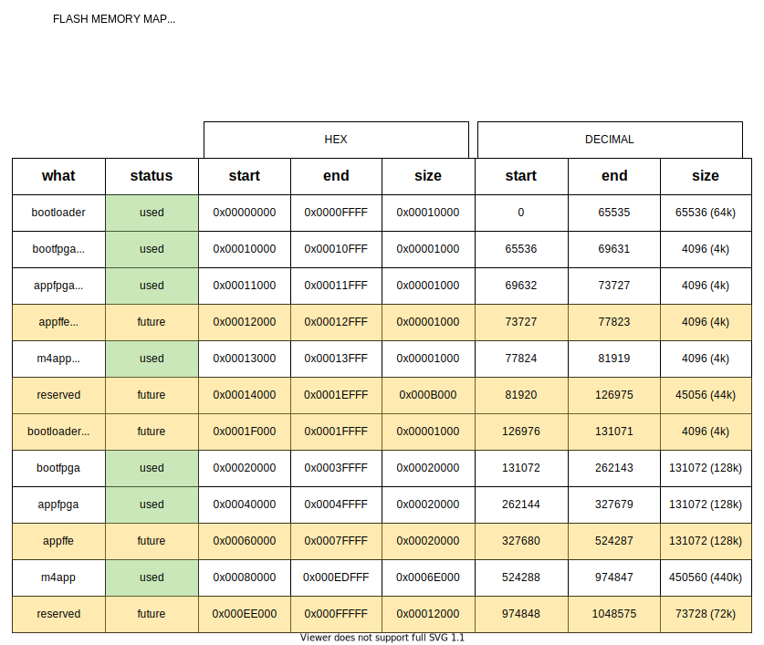

QuickFeather Bootloader Application (UART)
==========================================

The QuickFeather bootloader has a flash memory map for 5 bin files, and
corresponding CRC for each of them. The 5 bin files are:

::

   bootloader
   bootfpga
   m4app
   appfpga
   appffe (for future use)

The bootloader is loaded by a reset. It handles either communicating
with the TinyFPGA-Programmer to load new bin files into the flash, or it
loads m4 app binary and transfers control to it. The bootfpga area
contains the binary for the fpga image that the bootlaoder uses. The m4
app image is expected to contain and load any fpga image that it
requires.

The flash memory map defined for q-series devices is as below:

Communication Interface
-----------------------

This bootloader project uses EOS S3 UART on the Quickfeather board to 
receive and transmit commands from TinyFPGA Programmer.

Copy the file cli.py to the TinyFPGA-Programmer-Application folder. Then
invoke the following on the command line to write FPGA bit-stream to the
Quickfeather Flash and run the FPGA application

::

   $ python cli.py
   

Flashing and running an FPGA bitstream
-----------------------

The bootloader application qf_rs_bootloader running on the QuickFeather and 
the python application code cli.py could be used to flash and run an FPGA
bitstream on the quickfeather board.

Build qf_apps/qf_rs_bootloader application project. Flash quickfeather
board with qf_rs_bootloader.bin binary using TinyFPGA-Programmer-Application. 

::

  1. Connect USB cable to QuickFeather; see QuickFeather user guide for 
     more information
  2. Connect USB-UART cable to host PC and QuickFeather; see QuickFeather 
     user guide for more information
  3. Put he QuickFeather in flash mode
     a. Press reset button
     b. Press user button within 5 seconds
  4. Use tinyfpga-programmer-gui to load the new qf_rs_bootloader.bin 
     binary file.

     $ python tinyfpga-programmer-gui.py --bootloader qf_rs_bootloader.bin

  5. Now, power cycle the quickfeather board and put the quickfeather in 
     Flash mode by pressing the reset button followed by userbutton on the 
     board within 5 secs. 
  6. Copy the "cli.py" file to where tinyfpga-programmer-gui is installed.
  7. Open the console
  8. Run cli.py 

   $ python cli.py

   9. In cli.py console, issue the following commands
      a) [S3]> help
      displays the help menu

     b) [S3]> comport <COMxx>
   where <COMxx> is the COM port number assigned by the OS; see QuickFeather
   user guide for more information.
   
     c) [S3]> change-boot-mode 1 
     this command sets the boot configuration for subsequent system boot; 
     setting 1 forces the system to stay in flash mode upon reboot.
     
     d) [S3]> flashfpga inputfile
     where inputfile is the location and name of generated FPGA bit file
     
     e) [S3]> runfpga
     the bootloader configures the FPGA and executes the programmed FPGA 
     design.
     
  Note: Repeat steps d) and e) for each generated FPGA bit file for EOS S3B device
  Note: to restore the EVK function to execute M4 application, type: change-boot-mode 2
        to restore bootloader to the original behavior
  
