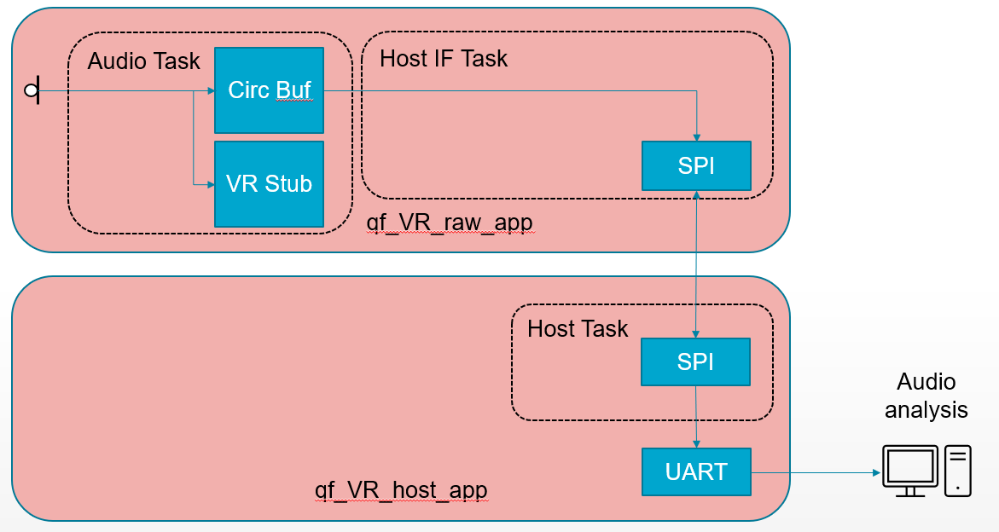
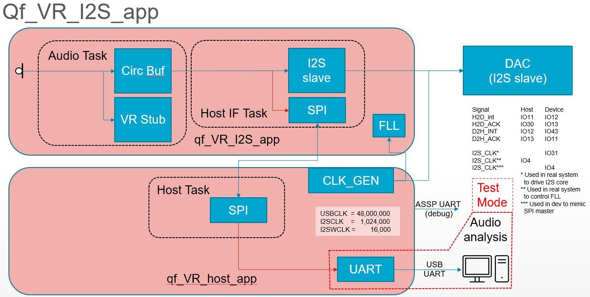

===========================
QORC Voice Recognition apps
===========================

Overview
========

This is a series of 5 example apps located in the qf_vr_apps directory.
Unfortunately, the major VR engines are covered by proprietary licenses,
so these app have stubs where proprietary code needs to be installed.
Each of the apps demonstrates a different building block. For many
applications the apps may be usable as is, and for a few the developer
will need to combine elements from different apps.

Key concepts
============

Datablock manager
-----------------

The qorc-sdk uses a datablock manager
(qorc-sdk/Libraries/DatablockManager) to handle high-speed real-time
data. During start-up the system allocates a pool of datablocks. During
audio processing the audio ISR obtains a block from the queue of free
blocks, fills it with data, and adds it to the processing queue. The
processing queue acts as an elastic buffer that can fill up when the
processer is heavily loaded, and drain when the processor is lightly
loaded, which allows variable rate handling of the audio data even
thought the input comes at a constant rate.

Datablocks can be assigned to more than one queue, and will only be
returned to the free queue when they are not allocated to any queue. An
example of assigning a datablock to more than one queue is when data is
streamed to a processing element, such as VR, and a storgae element such
as SD card.

Datablock processor
-------------------

A typical audio processing system has a number of processing elements
arranged in a pipeline where the output of one element feeds the input
of the next element. The qorc-sdk has a mechanism called the datablock
processor (qorc-sdk/Tasks/DatablockProcessor) designed to manage
pipelines of fucntions that use datablocks. Each pipeline is implemented
as a task. Each function is called a processing element, and the entire
pipeline is specified by an array that defines a list of processing
elements and which datablock queues they read data from and which
datablock queues they write data to. *CRITICAL*: all processing elements
must be non-blocking.

Host Interface Task
-------------------

Frequently the VR app needs to communicate with a BLE or WIFI device.
This interaction is managed by the Host Interface Task and usually
involves control packets that are communicated over a SPI link, and data
that is either compressed, packetized and transmitted over the SPI link,
or streamed isochronously over I2S.

VR Example Apps
===============

qf_1micVR_app: standalone app using a single microphone
-------------------------------------------------------

|qf_1micVR_app|

Purpose
~~~~~~~

Demonstrate the basic operation of the audio system and datablock
processor

Description
~~~~~~~~~~~

This is the most basic VR app. The audio pipeline is very simple:

::

   datablk_pe_descriptor_t  datablk_pe_descr_audio[] =
   {
   /* processing element descriptor for pre-processing */
   /*            in_id             out_id                  fActive  fSupplyOut fReleaseIn   poutq_processor                    pe_funcs          pe_bypass_func   p_pe_sem  */
   /* VR   */  { AUDIO_ISR_PID,    AUDIO_QL_VR_PID,            true, false, true,      &audio_ql_vr_outq_processor,            &ql_vr_funcs,           NULL,      &ql_vr_sem },
   };

The pipeline has one function for VR. It reads datablocks that have
PID=AUDIO_ISR_PID (the out_id is meaningless for the VR function). It is
*active*, meaning it will be called whenever a relevant datablock is
present, it does not need an empty datablock to use for output data, and
when processing is finished the datablock can be released (returned to
the free queue if it isn't on another queue). The output queue processor
is not relevant since VR does not produce output data. The routines to
be called are defined by the ql_vr_funcs structure (more on this later).
There is not bypass function, and the semaphore used to stop processing
while changing parameters is ql_vr_sem.

There are two functions used by the VR processing :

::

   /* ql vr processing element functions */
   datablk_pe_funcs_t ql_vr_funcs = {datablk_pe_config_ql_vr, datablk_pe_process_ql_vr, NULL, NULL, NULL } ;

one to configure and one to process datablocks.

Required hardware
~~~~~~~~~~~~~~~~~

-  QuickFeather

qf_2micVR_app: standalone app using two microphones with stub for beamforming
-----------------------------------------------------------------------------

|qf_2micVR_app|

.. _purpose-1:

Purpose
~~~~~~~

Demonstrate how to setup and handle stereo input.

.. _description-1:

Description
~~~~~~~~~~~

*Coming soon*

.. _required-hardware-1:

Required hardware
~~~~~~~~~~~~~~~~~

-  Modified QuickFeather (modifed to use external microphone)
-  Calaveras board (support 2 microphones)
-  Cradle (holds QuickFeather and Calaveras boards)

   -  QuickFeather AVS Cradle
   -  Dual QuickFeather Cradle

.. _qf_vr_raw_app-companion-app-implementing-vr-host-communications-over-spi-packetizing-raw-audio-with-and-streaming-the-audio-packets-over-spir:

qf_VR_raw_app: companion app implementing VR, host communications over SPI, packetizing raw audio with and streaming the audio packets over SPI.r
-------------------------------------------------------------------------------------------------------------------------------------------------

|qf_VR_raw_app|

.. _purpose-2:

Purpose
~~~~~~~

Demonstrate host/companion command protocol and raw audio streaming over
SPI.

.. _description-2:

Description
~~~~~~~~~~~

*Coming soon*

.. _required-hardware-2:

Required hardware
~~~~~~~~~~~~~~~~~

-  2xQuickFeather (one as companion, one as host)
-  I2S DAC board (audio output)
-  Cradle (holds QuickFeather companion and QuickFeather host)

   -  `Dual QuickFeather
      Cradle <https://github.com/QuickLogic-Corp/qf-cradle>`__

-  PC to receive and analyze audio packets

.. _qf_vr_opus_app-coming-soon-companion-app-implementing-vr-host-communications-over-spi-compressing-and-packetizing-audio-with-opus-and-streaming-the-audio-packets-over-spi:

qf_VR_opus_app: [coming soon] companion app implementing VR, host communications over SPI, compressing and packetizing audio with opus and streaming the audio packets over SPI.
--------------------------------------------------------------------------------------------------------------------------------------------------------------------------------

|qf_VR_opus_app|

.. _purpose-3:

Purpose
~~~~~~~

Demonstrate host/companion command protocol, opus compression and audio
streaming over SPI.

.. _description-3:

Description
~~~~~~~~~~~

*Coming soon*

.. _required-hardware-3:

Required hardware
~~~~~~~~~~~~~~~~~

-  2xQuickFeather (one as companion, one as host)
-  I2S DAC board (audio output)
-  Cradle (holds QuickFeather companion and QuickFeather host)

   -  Dual QuickFeather Cradle

-  PC to receive and decode opus packets

Optional: Local playback
~~~~~~~~~~~~~~~~~~~~~~~~

The hardware is configured to support real-time playback through DAC. No
plans for software support of this option. |qf_VR_opus_app_optional|

qf_VR_I2S_app: [coming soon] companion app implementing VR, host communications over SPI and streaming audio over I2S
---------------------------------------------------------------------------------------------------------------------

|qf_VR_I2S_app|

.. _purpose-4:

Purpose
~~~~~~~

Demonstrate host/companion command protocol, and I2S isochronous output
that handles host/companion clock synchronization.

.. _description-4:

Description
~~~~~~~~~~~

*Coming soon*

.. _required-hardware-4:

Required hardware
~~~~~~~~~~~~~~~~~

-  2xQuickFeather (one as companion, one as host)
-  I2S DAC board (audio output)
-  Cradle (holds QuickFeather companion and QuickFeather host)

   -  Dual QuickFeather Cradle

Optional: PC analysis
~~~~~~~~~~~~~~~~~~~~~

The hardware is configured to support recording of I2S data on a PC. No
plans for software support of this option. |qf_VR_opus_I2S_optional|

.. |qf_VR_opus_I2S_optional| image:: ./images/qf_VR_I2S_app_optional.png
