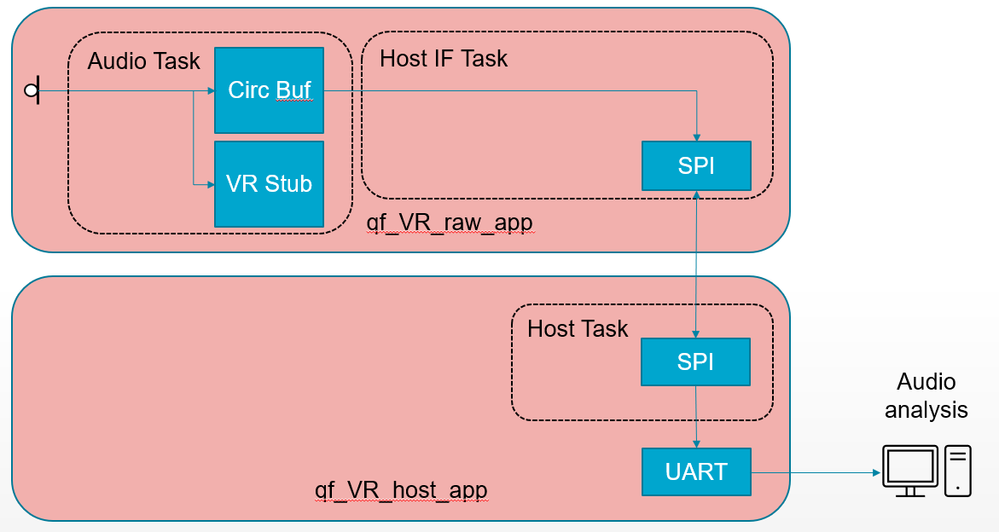
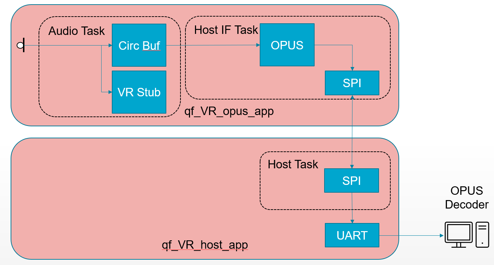
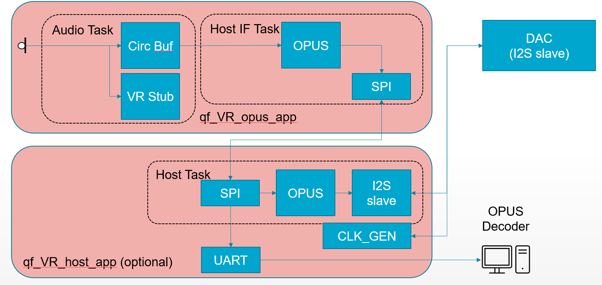
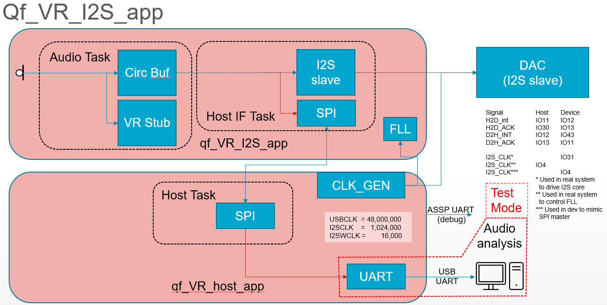
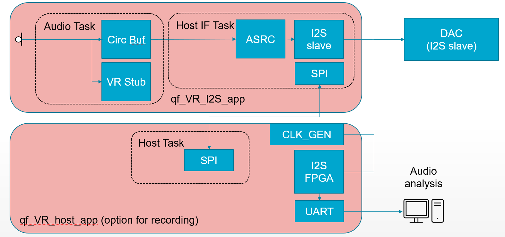

# QORC Voice Recognition apps

# Overview
This is a series of 5 example apps located in the  qf_vr_apps directory.  Unfortunately, the major VR engines are covered by
proprietary licenses, so these app have stubs where proprietary code needs to be installed.  Each of the apps demonstrates
a different building block.  For many applications the apps may be usable as is, and for a few the developer will need to
combine elements from different apps.

# Key concepts

## Datablock manager
The qorc-sdk uses a datablock manager (qorc-sdk/Libraries/DatablockManager) to handle high-speed real-time data.  During start-up the system allocates a pool of
datablocks.  During audio processing the audio ISR obtains a block from the queue of free blocks, fills it with data, and
adds it to the processing queue.  The processing queue acts as an elastic buffer that can fill up when the processer is heavily loaded,
and drain when the processor is lightly loaded, which allows variable rate handling of the audio data even thought the input comes at
a constant rate.

Datablocks can be assigned to more than one queue, and will only be returned to the free queue when they are not allocated to any queue.
An example of assigning a datablock to more than one queue is when data is streamed to a processing element, such as VR, and a storgae element such as SD card.

## Datablock processor
A typical audio processing system has a number of processing elements arranged in a pipeline where the output of one element feeds the input of the
next element.  The qorc-sdk has a mechanism called the datablock processor (qorc-sdk/Tasks/DatablockProcessor) designed to manage pipelines of fucntions that
use datablocks.  Each pipeline is implemented as a task. Each function is called a processing element, and the entire pipeline is specified
by an array that defines a list of processing elements and which datablock queues they read data from and which datablock queues they write data to.
*CRITICAL*: all processing elements must be non-blocking.

## Host Interface Task
Frequently the VR app needs to communicate with a BLE or WIFI device.  This interaction is managed by the Host Interface Task and usually involves
control packets that are communicated over a SPI link, and data that is either compressed, packetized and transmitted over the SPI link, or streamed
isochronously over I2S.

# VR Example Apps

## qf_1micVR_app: standalone app using a single microphone

### Purpose
Demonstrate the basic operation of the audio system and datablock processor
### Description
This is the most basic VR app.  The audio pipeline is very simple:
~~~
datablk_pe_descriptor_t  datablk_pe_descr_audio[] =
{
/* processing element descriptor for pre-processing */
/*            in_id             out_id                  fActive  fSupplyOut fReleaseIn   poutq_processor                    pe_funcs          pe_bypass_func   p_pe_sem  */
/* VR   */  { AUDIO_ISR_PID,    AUDIO_QL_VR_PID,            true, false, true,      &audio_ql_vr_outq_processor,            &ql_vr_funcs,           NULL,      &ql_vr_sem },
};
~~~
The pipeline has one function for VR.  It reads datablocks that have PID=AUDIO_ISR_PID (the out_id is meaningless for the VR function).  It is *active*, meaning it will be called whenever a relevant datablock is present,
it does not need an empty datablock to use for output data, and when processing is finished the datablock can be released (returned to the free queue if it isn't on another queue).
The output queue processor is not relevant since VR does not produce output data.  The routines to be called are defined by the ql_vr_funcs structure (more on this later).
There is not bypass function, and the semaphore used to stop processing while changing parameters is ql_vr_sem.

There are two functions used by the VR processing :
~~~
/* ql vr processing element functions */
datablk_pe_funcs_t ql_vr_funcs = {datablk_pe_config_ql_vr, datablk_pe_process_ql_vr, NULL, NULL, NULL } ;
~~~
one to configure and one to process datablocks.
### Required hardware
- QuickFeather

## qf_2micVR_app: standalone app using two microphones with stub for beamforming

### Purpose
Demonstrate how to setup and handle stereo input.
### Description
This VR app shows how to handle stereo input.  A common use case is beamforming, however, since the beamforming code is proprietary this example uses a simple 2:1 mixer to show how the interface works.
The audio piple line is similar to the 1 mic pipeline, simply adding a pre-processing stage:
~~~
datablk_pe_descriptor_t  datablk_pe_descr_audio[] =
{
/* processing element descriptor for pre-processing */
/*            in_id                    out_id            fActive  fSupplyOut fReleaseIn   poutq_processor         pe_funcs          pe_bypass_func   p_pe_sem */
/* NS   */  { AUDIO_ISR_PID,          AUDIO_QL_PRE_PROC_PID,     true, true,  true,  &audio_ql_pre_proc_outq_processor, &ql_pre_proc_funcs,     NULL,   &ql_pre_proc_sem },
/* VR   */  { AUDIO_QL_PRE_PROC_PID,  AUDIO_QL_VR_PID,           true, false, true,  &audio_ql_vr_outq_processor,       &ql_vr_funcs,           NULL,   &ql_vr_sem },
/*CirBuf*/  { AUDIO_QL_PRE_PROC_PID,  AUDIO_CIRCULAR_BUFFER_PID, true, false, false, &audio_ql_cirBuf_outq_processor,   &ql_audio_cirBuf_funcs, NULL,    NULL},
};
~~~
Data from the AUDIO_ISR is processed by a pre_proc function which produces one mono block for each 2 stereo blocks.
The output of this pre-processing has a PID of AUDIO_QL_PRE_PROC which is fed into the same VR function used by the 1-mic example.
### Required hardware
- Modified QuickFeather (modifed to use external microphone)
- Calaveras board (support 2 microphones)
-  (holds QuickFeather and Calaveras boards)
  - Quicklogic Expansion Board 1
  - Quicklogic Expansion Board 2 (coming soon)
  
## qf_VR_raw_app: [coming soon] companion app implementing VR, host communications over SPI, packetizing raw audio with and streaming the audio packets over SPI.r

### Purpose
Demonstrate host/companion command protocol and raw audio streaming over SPI.
### Description
*Coming soon*
### Required hardware
- 2xQuickFeather (one as companion, one as host)
- I2S DAC board (audio output)
- Cradle (holds QuickFeather companion and QuickFeather host)
  -  (coming soon)
- PC to receive and analyze audio packets
  

## qf_VR_opus_app: [coming soon] companion app implementing VR, host communications over SPI, compressing and packetizing audio with opus and streaming the audio packets over SPI.

### Purpose
Demonstrate host/companion command protocol, opus compression and audio streaming over SPI.

### Description
*Coming soon*
### Required hardware
- 2xQuickFeather (one as companion, one as host)
- I2S DAC board (audio output)
- Cradle (holds QuickFeather companion and QuickFeather host)
  -  (coming soon)
- PC to receive and decode opus packets

### Optional: Local playback
The hardware is configured to support real-time playback through DAC.  No plans for software support of this option.

## qf_VR_I2S_app: [coming soon] companion app implementing VR, host communications over SPI and streaming audio over I2S

### Purpose
Demonstrate host/companion command protocol, and I2S isochronous output that handles host/companion clock synchronization.
### Description
*Coming soon*
### Required hardware
- 2xQuickFeather (one as companion, one as host)
- I2S DAC board (audio output)
- Cradle (holds QuickFeather companion and QuickFeather host)
  -  (coming soon)
 
### Optional: PC analysis
The hardware is configured to support recording of I2S data on a PC.  No plans for software support of this option.

